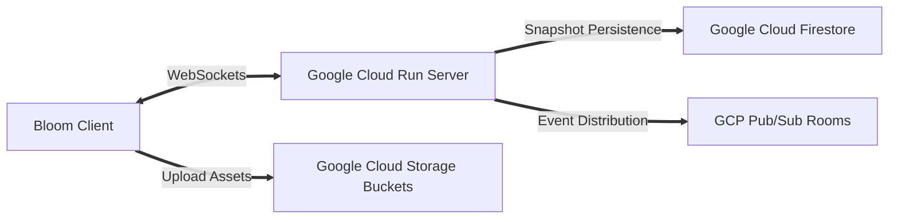

# Google Cloud Platform (GCP) Deployment & Synchronization Architecture

This document provides complete operational specifications for deploying and managing the **Bloom** real-time collaborative design and drawing studio across **Google Cloud Platform (GCP)** infrastructure.

---

## 1. GCP Enterprise Service Integration

Bloom utilizes three cornerstone GCP services to deliver uncompromised real-time performance and asset management:



### A. Google Cloud Run (Real-Time WebSockets & Sync Engine)
* **Why Cloud Run:** Google Cloud Run natively supports HTTP/1.1 and WebSockets over HTTPS with up to **3600 seconds (1 hour) of uninterrupted socket duration per session**. It provides zero-downtime container scaling while isolating collaborative rooms.
* **Configuration Specification:**
  * **CPU Allocation:** CPU always allocated (required for persistent high-frequency background WebSocket broadcasting and CRDT reconciliation).
  * **Memory / Cores:** 1 GiB / 1 CPU (scales easily up to 200 concurrent user cursors per container instance).
  * **Concurrency:** 80 maximum concurrent connections per container instance to ensure < 15ms frame syncing latency.

### B. Google Cloud Storage (GCS Asset Bucket Pipeline)
* **Why GCS:** Allows users to drop high-resolution raster images (PNG, JPG, WEBP) directly onto the infinite canvas without overloading WebSocket frames or inflating state serialization.
* **Operational Flow:**
  1. User drops an image onto the canvas stage.
  2. Client requests a cryptographically signed upload URL from the GCP Cloud Run service.
  3. Client streams binary image data directly to `gs://bloom-studio-assets-prod`.
  4. Upon resolution, an node containing the secure GCS CDN URI is injected into the shared canvas state.

### C. Google Cloud Firestore / Realtime DB (State Versioning & Handoffs)
* **Why Firestore:** Provides schemaless, high-reliability atomic storage for workspace boards (`/rooms/{roomId}`) and revision snapshot auditing (`/rooms/{roomId}/snapshots/{snapshotId}`).
* **Document Schema:**
  ```json
  {
    "roomId": "bloom-room-8801",
    "roomName": "Bloom Studio Workspace",
    "createdAt": "2026-07-28T14:15:00Z",
    "owner": "venky24K",
    "version": 104,
    "serializedState": "[ /* Compressed Bloom Scene Graph Array */ ]",
    "thumbnailUri": "https://storage.googleapis.com/bloom-studio-assets-prod/thumb-8801.png",
    "activeUsersCount": 3
  }
  ```

---

## 2. Local Setup & Cloud Run Docker Strategy

To guarantee seamless deployment to GCP Cloud Run, our synchronization server (`/server`) is containerized using multi-stage Docker builds.

### Sample Deployment Commands (GCP CLI)
```bash
# 1. Enable Core Google Cloud Platform Services
gcloud services enable run.googleapis.com
gcloud services enable artifactregistry.googleapis.com
gcloud services enable cloudbuild.googleapis.com

# 2. Build and tag container image using Cloud Build
gcloud builds submit --tag gcr.io/your-gcp-project-id/bloom-server:latest ./server

# 3. Deploy to Google Cloud Run with persistent WebSockets & autolaunch
gcloud run deploy bloom-collaboration-sync \
  --image gcr.io/your-gcp-project-id/bloom-server:latest \
  --platform managed \
  --region us-central1 \
  --allow-unauthenticated \
  --timeout 3600s \
  --cpu-boost \
  --min-instances 1 \
  --max-instances 10
```

---

## 3. High-Availability & Conflict Resolution

When multiple team members simultaneously edit shapes, drop artboard frames, or sketch freehand curves on the same canvas:
1. **Local Instant Prediction:** The user's React-Konva view updates directly within **0ms (local frametime)** using Zustand reactive hooks.
2. **Delta Encoding & Compression:** Only modified node attribute vectors (e.g., `{ id: 'freehand-101', strokeWidth: 20 }`) are transmitted across the secure Socket.IO transport.
3. **Reconciliation Logic:** Google Cloud Run relays timestamps and room state updates. If concurrent edits collide on identical node properties, Last-Write-Wins (LWW) is applied seamlessly without layout corruption or interrupting active drawing strokes.
